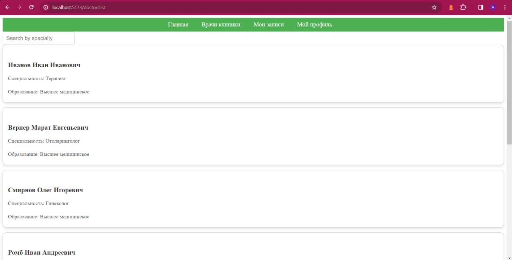
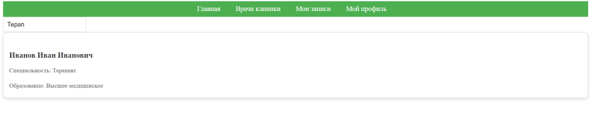
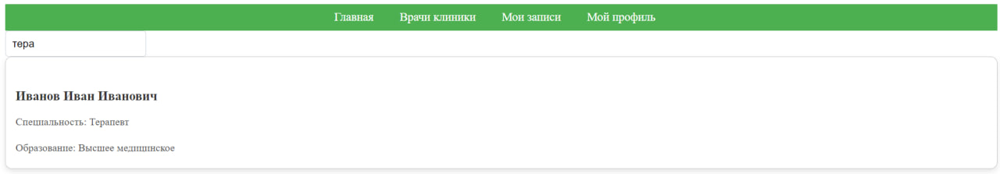

# DoctorList.vue





``` 
<template>
  <div>
    <div class="mb-3">
      <input type="text" v-model="searchSpecialty" placeholder="Search by specialty" class="form-control">
    </div>
    <div class="row">
      <div class="col-md-4 mb-3" v-for="doctor in filteredDoctors" :key="doctor.id">
        <div class="card">
          <div class="card-body">
            <h5 class="card-title">{{ doctor.last_name }} {{ doctor.first_name }} {{ doctor.middle_name }}</h5>
            <p class="card-text">Специальность: {{ doctor.specialty }}</p>
            <p class="card-text">Образование: {{ doctor.education }}</p>
          </div>
        </div>
      </div>
    </div>
  </div>
</template>
<style scoped>
.mb-3 input[type="text"] {
  border-radius: 5px;
  border: 1px solid #ced4da;
  padding: 10px;
  font-size: 16px;
}

.card {
  box-shadow: 0 4px 8px rgba(0, 0, 0, 0.1);
  border-radius: 10px;
  overflow: hidden;
  transition: transform 0.3s ease-in-out, box-shadow 0.3s ease-in-out;
}

.card:hover {
  transform: translateY(-5px);
  box-shadow: 0 6px 12px rgba(0, 0, 0, 0.2);
}

.card-body {
  padding: 15px;
}

.card-title {
  margin-bottom: 10px;
  color: #333;
  font-size: 20px;
  font-weight: bold;
}

.card-text {
  color: #555;
  font-size: 16px;
  margin-bottom: 5px;
}
</style>
  
  <script>
import axios from 'axios';
  
  export default {
    data() {
      return {
        doctors: [],
        searchSpecialty: '',
      };
    },
    computed: {
    filteredDoctors() {
      return this.doctors.filter(doctor => {
        return doctor.specialty.toLowerCase().includes(this.searchSpecialty.toLowerCase());
      });
    }
  },
    mounted() {
      const url = 'http://127.0.0.1:8000/api/doctors/';
      const token = '5f48f363d33088d0870df16233ee16cbe7650dfc';
  
      const config = {
        headers: { Authorization: `Token ${token}` }
      };
  
      axios.get(url, config)
        .then(response => {
          this.doctors = response.data;
        })
        .catch(error => {
          console.error('Error fetching doctors:', error);
        });
    }
  };

</script>


<style>
.card {
  border: 1px solid #ccc;
  border-radius: 5px;
  margin-bottom: 15px;
}
.card-title {
  font-size: 1.25rem;
  margin-bottom: 0.5rem;
}
.card-text {
  color: #666;
}
</style>
```