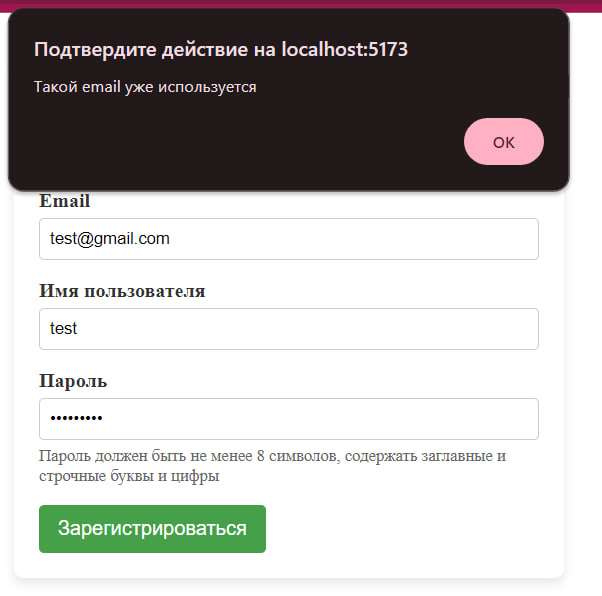

# RegisterPatient.vue





``` 
<template>
  <div class="register">
    <h1>Регистрация</h1>
    <form @submit="registerPatient" style="margin-top: 20px;">
      <div class="form-group">
        <label for="email">Email</label>
        <input type="email" id="email" v-model="email" required>
      </div>
      <div class="form-group">
        <label for="username">Имя пользователя</label>
        <input type="text" id="username" v-model="username" required>
      </div>
      <div class="form-group">
        <label for="password">Пароль</label>
        <input type="password" id="password" v-model="password" required>
        <small>Пароль должен быть не менее 8 символов, содержать заглавные и строчные буквы и цифры</small>
      </div>
      <button type="submit">Зарегистрироваться</button>
    </form>
  </div>
</template>

<style scoped>
.register {
  max-width: 400px;
  margin: 40px auto;
  padding: 20px;
  border-radius: 8px;
  box-shadow: 0 4px 8px rgba(0, 0, 0, 0.1);
  background-color: #fff;
}

.register-form {
  display: flex;
  flex-direction: column;
}

h1 {
  text-align: center;
  color: #333;
}

.form-group {
  margin-bottom: 15px;
}

label {
  display: block;
  margin-bottom: 5px;
  color: #333;
  font-weight: bold;
}

input[type="email"],
input[type="text"],
input[type="password"] {
  width: 100%;
  padding: 8px;
  border: 1px solid #ccc;
  border-radius: 4px;
  box-sizing: border-box;
}

small {
  display: block;
  margin-top: 5px;
  color: #666;
}

button {
  padding: 10px 15px;
  background-color: #4CAF50;
  color: white;
  border: none;
  border-radius: 4px;
  cursor: pointer;
  font-size: 16px;
  transition: background-color 0.3s ease;
}

button:hover {
  background-color: #45a049;
}
</style>

<script>
import axios from 'axios';
import router from '@/router';


export default {
  data() {
    return {
      email: '',
      username: '',
      password: '',
    };
  },
  methods: {
    registerPatient(event) {
      event.preventDefault();
      

      const formData = {
        email: this.email,
        username: this.username,
        password: this.password,
      };

      axios.post('http://127.0.0.1:8000/auth/users/', formData)
        .then(response => {
          console.log(response.data);
          localStorage.setItem('userData', JSON.stringify(formData));
          router.push('/profilepatient');

          
        })
        .catch(error => {
          if (error.response.status === 400) {
            alert('Такой email уже используется');
          } else {
            console.log(error);
          }
        });
    },
  },
};
</script>

```