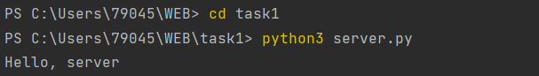
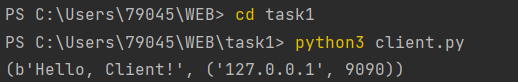

# Task 1

Реализовать клиентскую и серверную часть приложения. Клиент отсылает серверу
сообщение «Hello, server». Сообщение должно отразиться на стороне сервера.
Сервер в ответ отсылает клиенту сообщение «Hello, client». Сообщение должно
отобразиться у клиента.

Обязательно использовать библиотеку socket

Реализовать с помощью протокола UDP

### Реализация сервера
```python
import socket  

host = 'localhost'

port = 9090 

addr = (host, port) #адрес сервера состоит из хоста и порта

s = socket.socket(socket.AF_INET, socket.SOCK_DGRAM) #создание объекта сокета с использованием протокола IPv4 и UDP

s.bind(addr) #связывание сокета с адресом сервера

while True: 

    data, addr = s.recvfrom(1024) #получение данных и адреса клиента; 1024 - максимальное количество байт, которые можно получить за один раз

    print(data.decode('utf-8')) #decode() используется для преобразования байтов в строку

    s.sendto(b'Hello, Client!', addr) #отправка ответа клиенту; b'Hello, Client!' - байтовая строка, которая будет отправлена
```

### Реализация клиента

```python
import socket

host = 'localhost' 

port = 9090 

addr = (host, port) #адрес сервера состоит из хоста и порта

s = socket.socket(socket.AF_INET, socket.SOCK_DGRAM) #создание объекта сокета с использованием протокола IPv4 и UDP

data = 'Hello, server' #данные для отправки на сервер

data = str.encode(data) #преобразование строки в байтовую строку

s.sendto(data, addr) #отправка данных на сервер

data = bytes.decode(data) #преобразование байтовой строки в строку

data = s.recvfrom(1024) #получение ответа от сервера; 1024 - максимальное количество байт, которые можно получить за один раз

print(data)
```
#### Выполнение работы


