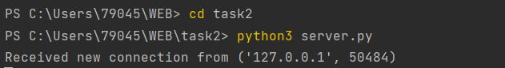
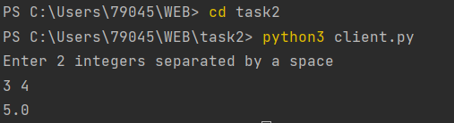

# Task 2

Реализовать клиентскую и серверную часть приложения. Клиент запрашивает у
сервера выполнение математической операции, параметры, которые вводятся с
клавиатуры. Сервер обрабатывает полученные данные и возвращает результат
клиенту.

Обязательно использовать библиотеку socket

Реализовать с помощью протокола TCP

Вариант 5 - Теорема Пифагора

### Реализация сервера
```python
import socket

host = 'localhost'

port = 9090

addr = (host,port) #адрес сервера состоит из хоста и порта

s = socket.socket(socket.AF_INET, socket.SOCK_STREAM) #создание объекта сокета с использованием протокола IPv4 и TCP

s.bind(addr) #связывание сокета с адресом сервера

s.listen() #переводим сокет в режим прослушивания входящих подключений

while True:

    conn, addr = s.accept() #принимаем входящее подключение и получаем объект соединения и адрес клиента

    print('Received new connection from', addr)

    conn.send(b'Enter 2 integers separated by a space')  #отправляем сообщение клиенту с запросом данных

    data = conn.recv(1024) #получаем данные от клиента
    
    a, b = list(map(int, data.decode('utf-8').split()))
    
    result = (a^2 + b^2)^0.5 #обрабатываем их
    
    conn.sendall(str(result).encode('utf-8')) #отправляем ответ

    conn.close() #закрываем соединение
```

### Реализация клиента

```python
import socket

host = 'localhost'

port = 9090

addr = (host,port) #адрес сервера состоит из хоста и порта

s = socket.socket(socket.AF_INET, socket.SOCK_STREAM) #создание объекта сокета с использованием протокола IPv4 и TCP

s.connect(addr) #устанавливаем соединение с сервером

message = s.recv(1024) #получаем сообщение от сервера

print(message.decode('utf-8')) #выводим его в консоль

data = input().encode('utf-8') # полученные данные преобразуем в байтовую строку
s.send(data) #отправляем на сервер

print(s.recv(1024).decode('utf-8'))
```

#### Выполнение работы


