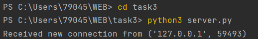
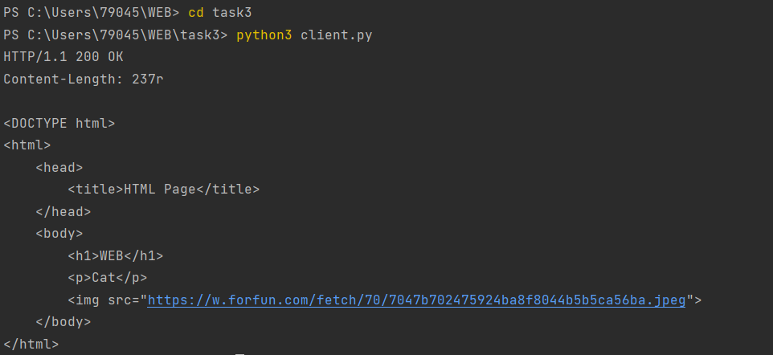

# Task 3

Реализовать серверную часть приложения. Клиент подключается к серверу. В ответ
клиент получает http-сообщение, содержащее html-страницу, которую сервер
подгружает из файла index.html.

Обязательно использовать библиотеку socket

### Реализация сервера
```python
import socket

host = 'localhost'
port = 9090
addr = (host, port) #адрес сервера состоит из хоста и порта

s = socket.socket(socket.AF_INET, socket.SOCK_STREAM) #создание объекта сокета с использованием протокола IPv4 и TCP
s.bind(addr)  #связывание сокета с адресом сервера

s.listen() #переводим сокет в режим прослушивания входящих подключений

while True:
        conn, addr = s.accept() #принимаем входящее подключение и получаем объект соединения и адрес клиента
        print('Received new connection from', addr)
        with open('index.html', 'r', encoding='utf-8') as file:  #открываем файл index.html и читаем его содержимое
                body = file.read()
        response = f"HTTP/1.1 200 OK\r\nContent-Length: {len(body)}r\n\r\n{body}" #формируем HTTP-ответ с заголовком и телом сообщения
        conn.sendall(response.encode('utf-8')) #отправляем ответ клиенту
        conn.close() #закрываем соединение
```

### Реализация клиента
```python
import socket

host = 'localhost'
port = 9090
addr = (host,port) #адрес сервера состоит из хоста и порта

s = socket.socket(socket.AF_INET, socket.SOCK_STREAM) #создание объекта сокета с использованием протокола IPv4 и TCP

s.connect(addr) #связывание сокета с адресом сервера

request = "GET / HTTP/1.1\r\nHost: localhost\r\n\r\n" #формируем HTTP-запрос для получения содержимого главной страницы 
s.sendall(request.encode('utf-8')) #отправляем запрос на сервер

response = b"" #ответ от сервера записываем в переменную response
while True:
    try:
        data = s.recv(1024)
    except:
        break
    response += data

s.close() #закрываем соединение с сервером

http_response = response.decode('utf-8') #декодируем ответ из байтовой строки в строку в формате UTF-8

head, body = http_response.split('\r\n', 1) #разделяем заголовок и тело сообщения и выводим на экран
print(head)
print(body)
```
### Html-страница
```python
<DOCTYPE html>
<html>
    <head>
        <title>HTML Page</title>
    </head>
    <body>
        <h1>WEB</h1>
        <p>Cat</p>
        
    </body>
</html>
``` 

<DOCTYPE html>
<html>
    <head>
        <title>HTML Page</title>
    </head>
    <body>
        <h1>WEB</h1>
        <p>Cat</p>
        
    </body>
</html> 

#### Выполнение работы

