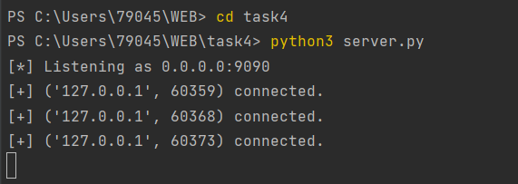
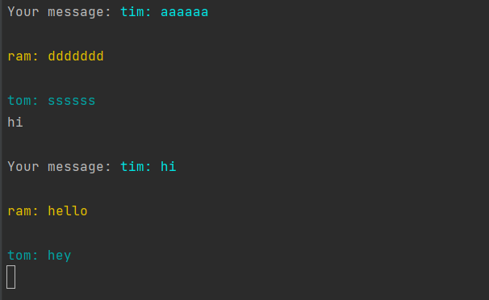
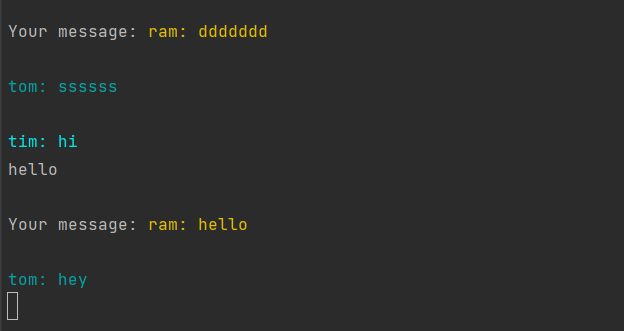
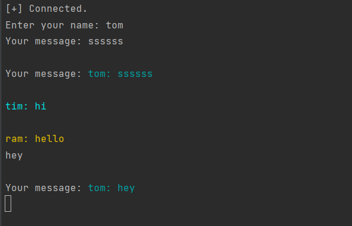

# Task 4
Реализовать двухпользовательский или многопользовательский чат. Реализация
многопользовательского часа позволяет получить максимальное количество
баллов.

Реализовать с помощью протокола TCP – 100% баллов, с помощью UDP – 80%.

Обязательно использовать библиотеку threading.

### Реализация сервера
```python
import socket
from threading import Thread

host = "0.0.0.0"
port = 9090
separator_token = "<sep>" #токен-разделитель для сообщений

client_sockets = set() #пустое множество для хранения клиентских сокетов
s = socket.socket(socket.AF_INET, socket.SOCK_STREAM) #создание объекта сокета с использованием протокола IPv4 и TCP
s.setsockopt(socket.SOL_SOCKET, socket.SO_REUSEADDR, 1) #устанавливаем опцию SO_REUSEADDR для повторного использования адреса при перезапуске сервера
s.bind((host, port)) #связывание сокета с адресом сервера
s.listen() #переводим сокет в режим прослушивания входящих подключений
print(f"[*] Listening as {host}:{port}") #вывод информацию о том, что сервер запущен и прослушивает заданный адрес и порт

def listen_for_client(cs): #функция для прослушивания сообщений от клиента
    while True:
        try:
            message = cs.recv(1024).decode()  #принимаем сообщение от клиента и декодируем его из байтовой строки в строку в формате UTF-8
        except Exception as e:
            print(f"[!] Error: {e}")
            client_sockets.remove(cs)   #если произошла ошибка при принятии сообщения, удаляем клиентский сокет из множества
        else:
            message = message.replace(separator_token, ": ")  #заменяем токен-разделитель на двоеточие в принятом сообщении
        for client_socket in client_sockets: #отправляем принятое сообщение клиентам
            client_socket.send(message.encode())


while True:
    client_socket, client_address = s.accept() #принимаем входящее подключение и получаем объект соединения и адрес клиента
    print(f"[+] {client_address} connected.") #выводим информации, что новый клиент подключился
    client_sockets.add(client_socket) #добавляем клиентский сокет в множество
    t = Thread(target=listen_for_client, args=(client_socket,))  #создаем поток для прослушивания сообщений от нового клиента
    t.daemon = True #устанавливаем флаг для потока, чтобы он завершался при завершении основного потока сервера
    t.start()

for cs in client_sockets: #закрываем все клиентские сокеты и серверный сокет
    cs.close()
s.close()
```

### Реализация клиента
```python
import socket
import random #импортируем модуль random для выбора случайного цвета для клиента
from threading import Thread
from colorama import Fore, init, Back #импортируем модуль colorama для изменения цвета текста в консоли

init() #инициализируем модуль colorama

colors = [Fore.BLUE, Fore.CYAN, Fore.GREEN, Fore.LIGHTBLACK_EX,
    Fore.LIGHTBLUE_EX, Fore.LIGHTCYAN_EX, Fore.LIGHTGREEN_EX,
    Fore.LIGHTMAGENTA_EX, Fore.LIGHTRED_EX, Fore.LIGHTWHITE_EX,
    Fore.LIGHTYELLOW_EX, Fore.MAGENTA, Fore.RED, Fore.WHITE, Fore.YELLOW] #создаем список цветов для клиентов

client_color = random.choice(colors) #выбираем случайный цвет для клиента

host = "127.0.0.1"
port = 9090
separator_token = "<sep>" #токен-разделитель для сообщений

s = socket.socket(socket.AF_INET, socket.SOCK_STREAM) #создание объекта сокета с использованием протокола IPv4 и TCP
print(f"[*] Connecting to {host}:{port}...")
s.connect((host, port)) #подключение к серверу по заданному адресу и порту
print("[+] Connected.")
name = input("Enter your name: ")

def listen_for_messages(): #функция для прослушивания сообщений от сервера
    while True:
        message = s.recv(1024).decode() #принимаем сообщение от сервера и декодируем из байтовой строки в строку в формате UTF-8
        print("\n" + message)


t = Thread(target=listen_for_messages) #создаем поток для прослушивания сообщений от сервера
t.daemon = True #устанавливаем флаг для потока, чтобы он завершался при завершении основного потока сервера
t.start() #запускаем поток

while True:
    to_send =input("Your message")
    if to_send.lower() == 'stop': #если пользователь ввел "stop", завершаем цикл
        break
    to_send = f"{client_color}{name}{separator_token}{to_send}{Fore.RESET}"  #формируем сообщение для отправки на сервер, включая имя клиента, сообщение и цвет текста
    s.send(to_send.encode())  #отправляем сообщение на сервер, закодировав в байтовую строку в формате UTF-8

s.close()
```
#### Выполнение работы



