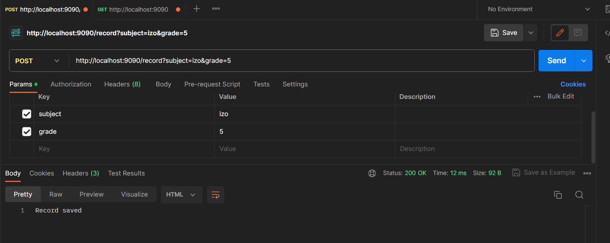
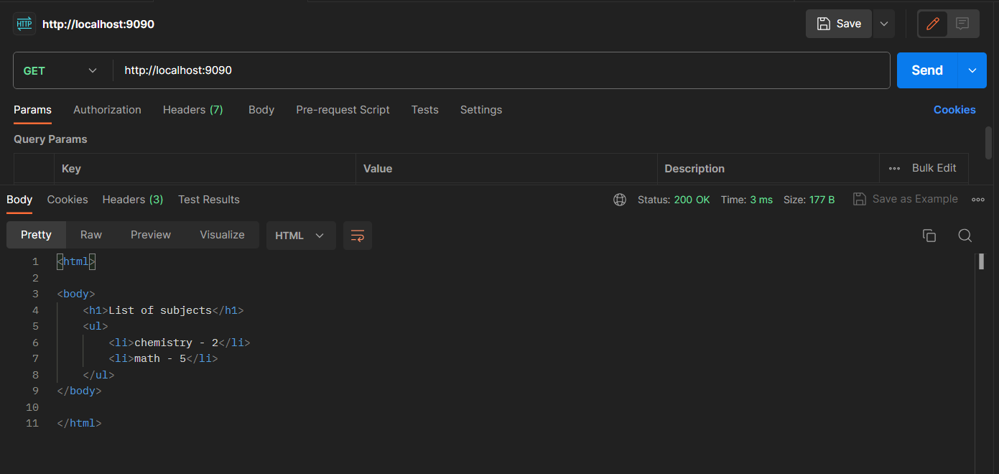
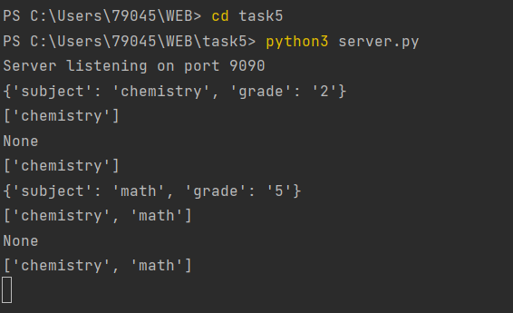

# Task 5

Необходимо написать простой web-сервер для обработки GET и POST http
запросов средствами Python и библиотеки socket.

Задание: сделать сервер, который может:

● Принять и записать информацию о дисциплине и оценке по дисциплине.

● Отдать информацию обо всех оценах по дсициплине в виде html-страницы.

### Реализация сервера
```python
import socket
import sys

class MyHTTPServer: #класс MyHTTPServer для создания веб-сервера
    def __init__(self, host, port, server_name): #метод init для инициализации объекта сервера
        self._host = host
        self._port = port
        self._server_name = server_name
        self.grades = [] #пустые списки для хранения оценок и предметов
        self.subjects = []

    def serve_forever(self): #метод serve_forever для запуска сервера и ожидания запросов от клиентов
        serv_sock = socket.socket(
            socket.AF_INET,
            socket.SOCK_STREAM,  #создание объекта сокета с использованием протокола IPv4 и TCP
            proto=0
        )

        try:
            serv_sock.bind((self._host, self._port))  #привязка объект сокета к заданному адресу и порту
            serv_sock.listen() #прослушивание входящих соединений

            while True:
                conn, _ = serv_sock.accept() #принимаем входящее соединение и создаем объект сокета для общения с клиентом
                try:
                    self.serve_client(conn) #обрабатываем запрос от клиента
                except Exception as e:
                    print('Client serving failed', e) #ри возникновении любой ошибки при обработке запроса от клиента, выводится сообщение об ошибке
        finally:
            serv_sock.close()

    def serve_client(self, conn): #метод serve_client для обработки запроса от клиента
        try:
            req = self.parse_request(conn) #получаем запрос от клиента и парсим его
            if req.method == 'GET':  #если метод GET, обрабатываем запрос и формируем ответ
                resp = self.get_request(req)
            elif req.method == 'POST':  #если метод POST, обрабатываем запрос и формируем ответ
                resp = self.post_request(req)
            else:  #если метод не GET и не POST, формируем ответ с ошибкой
                resp = self.make_response(405, 'Method Not Allowed', 'Only GET and POST methods are supported.')

            self.send_response(conn, resp) #отправляем ответ клиенту
        except ConnectionResetError: #если соединение было сброшено клиентом, закрываем объект сокета
            conn = None
        except Exception as e: #если произошла ошибка, отправляем клиенту ответ с ошибкой
            self.send_error(conn, e)

        if conn:
            conn.close() #закрываем объект сокета

    def parse_request(self, conn): #метод parse_request для парсинга запроса от клиента
        request_data = b'' #данные запроса от клиента
        while b'\r\n\r\n' not in request_data:
            data = conn.recv(1024)  # Получение данных запроса
            if not data:
                break
            request_data += data

        if not request_data: #проверка, что переменная request_data не пустая
            raise ValueError('Invalid request')

        request_lines = request_data.decode('utf-8').split('\r\n') #декодируем данные запроса из байтовой строки в строку в формате UTF-8
        method, path, _ = request_lines[0].split(' ') #из request_lines[0] извлекаются метод и путь к запрашиваемому ресурсу
        headers = {} #в headers записывается пустой словарь, который будет заполнен заголовками запроса 

        for line in request_lines[1:]: #проход по всем строкам запроса, начиная со второй строки
            if ':' in line: #если текущая строка содержит символ ":", то она является заголовком запроса
                key, value = line.split(':', 1)  #разделяем строку на ключ и значение по символу ":"
                headers[key.strip()] = value.strip() #добавляем заголовок в словарь headers, удаляя при этом лишние пробелы в начале и конце строк

        params = ( 
            {p.split("=")[0]: p.split("=")[1] for p in path.split("?")[1].split("&")}
            if "?" in path
            else None
        ) #параметры запроса (если они есть)
        print(params)

        return HTTPRequest(method, path.split("?")[0], headers, params)   #возвращаем объект HTTPRequest с методом, путем, заголовками и параметрами запроса

    def get_request(self, req):  #метод handle_get_request для обработки GET-запроса от клиента
        if req.path == '/':
            response_body = '<html><body><h1>List of subjects</h1><ul>{}</ul></body></html>' #если путь запроса корневой, формируем ответ со списком предметов и оценок
            items = ''.join('<li>{} - {}</li>'.format(subject, grade) for subject, grade in zip(self.subjects, self.grades))
            print(self.subjects)
            response_body = response_body.format(items)
            return self.make_response(200, 'OK', response_body)
        else: #если путь запроса не корневой, формируем ответ с ошибкой
            return self.make_response(404, 'Not Found', 'Page not found')

    def post_request(self, req):  # метод handle_post_request для обработки POST-запроса от клиента
        if req.path == '/record':  #если путь запроса /record, сохраняем предмет и оценку в соответствующие списки
            self.grades.append(req.params.get("grade"))
            self.subjects.append(req.params.get("subject"))
            print(self.subjects)
            return self.make_response(200, 'OK', 'Record saved') #формируем ответ об успешном сохранении записи
        else:
            return self.make_response(404, 'Not Found', 'Page not found')  #если путь запроса не /record, формируем ответ с ошибкой

    def make_response(self, status_code, status_text, body): #метод create_response для формирования ответа на запрос
        response = f"HTTP/1.1 {status_code} {status_text}\r\n"
        response += f"Server: {self._server_name}\r\n"
        response += "Content-Type: text/html\r\n"
        response += f"Content-Length: {len(body)}\r\n"
        response += "\r\n"
        response += body

        return response.encode('utf-8')

    def send_response(self, conn, resp): #метод send_response для отправки ответа клиенту
        conn.sendall(resp)

    def send_error(self, conn, err): #метод send_error для отправки ответа с ошибкой клиенту
        error_message = f"HTTP/1.1 500 Internal Server Error\r\n\r\nError: {err}"
        conn.sendall(error_message.encode('utf-8'))

class HTTPRequest:  #класс HTTPRequest для хранения информации о запросе от клиента
    def __init__(self, method, path, headers, params):
        self.method = method
        self.path = path
        self.headers = headers
        self.params = params

    def read_body(self, length): #метод read_body считывает тело запроса
        body = b''
        while len(body) < length: #пока длина body меньше заданной длины length, считываются данные из соединения
            data = self.conn.recv(length - len(body))
            if not data: #если данные не были получены, то цикл прерывается
                break
            body += data
        return body.decode('utf-8') #возвращаем тело запроса в виде строки, декодированной из байтовой последовательности в кодировке UTF-8

if __name__ == '__main__':
    host = 'localhost'
    port = 9090
    name = 'server'

    serv = MyHTTPServer(host, port, name) #содается объект serv, который представляет собой экземпляр класса MyHTTPServer с указанными параметрами
    print("Server listening on port", port)
    try:
        serv.serve_forever()
    except KeyboardInterrupt: #если при работе сервера происходит исключение KeyboardInterrupt,то программа завершается без ошибок
        pass
```

#### Выполнение работы





